<div align="center">

<a href="https://github.com/brazyqueso">
  
</a>

**Kali tooling · Norway · built with [Pakun](https://github.com/brazyqueso)**

Wireless assessment station, desktop clients, and small terminal utilities.

</div>

---

### Arsenal

| Project | Stack | Description |
|:--------|:------|:------------|
| **[ACS](https://github.com/iinze0/ACS)** | Shell · `.deb` | Air Crack Station — terminal menu for authorized wireless lab work |
| **[ACS-app](https://github.com/iinze0/ACS-app)** | Python · `.deb` | Desktop client for the same station |
| **[ACS-cpp](https://github.com/iinze0/ACS-cpp)** | C++ · GTK · `.deb` | Native desktop build |
| **[ctrl-a](https://github.com/iinze0/ctrl-a)** | C++ · `.deb` | Ctrl+A select-all for Kali’s normal terminal |
| **[fang](https://github.com/iinze0/fang)** | Shell | Modular Kali network toolkit |

---

```bash
$ whoami
iinze0 // Norway

$ cat mission.txt
Build the station. Keep it useful.
Ship it as a package people can actually install.

$ ls ~/tools
ACS  ACS-app  ACS-cpp  ctrl-a  fang
```

<div align="center">

`[ root@kali ]# _`

</div>
